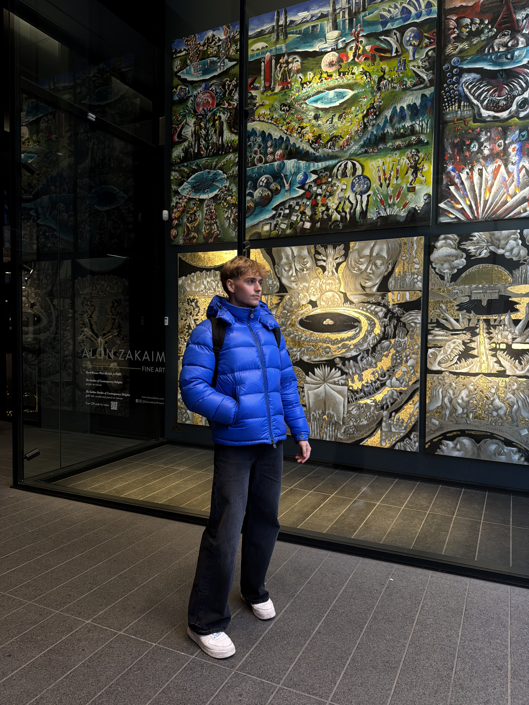

  

    
  

  

    <h1 class="about-name">Aleksander Lupa</h1>
    
Business Studies student · DCU · Bodybuilder

    

      Business Analytics
      Data &amp; Dashboards
      Bodybuilding
    

    <a href="assets/alex.cv.pdf" download class="about-cv-btn">Download CV</a>
  

## About me

I'm a final-year Business Studies student at Dublin City University, specialising in Business Analytics. I'm passionate about the point where business questions meet technical problem-solving — using data to clarify what's happening, why it's happening, and what to do next.

My toolkit spans Python (Pandas/NumPy), SQL/MySQL, Power BI/Tableau, Excel, and web fundamentals including HTML/CSS. I enjoy the full analytical cycle: framing the business problem, building tidy data models, testing assumptions, and communicating insights that drive real decisions.

Outside of work and college, I'm a dedicated bodybuilder. The discipline and consistency that the sport demands carries into everything else I do.

## Skills

  

    Python · Pandas/NumPy
    

    80%
  

  

    SQL / MySQL
    

    80%
  

  

    Power BI / Tableau
    

    75%
  

  

    Excel
    

    85%
  

  

    HTML / CSS / JS
    

    65%
  

  

    Data reporting
    

    80%
  

## Experience

  

    

    

      
Underwriting Operations Assistant

      
Allied World, Dublin &nbsp;·&nbsp; May 2024 – Aug 2025

      
Updated accounts to underwriter instructions within SLAs and produced recurring management reports with validated figures. Maintained audit-ready databases, liaised with Finance on reconciliations, and onboarded and trained new hires.

    

  

  

    

    

      
Shift Runner

      
SSP UK &amp; Ireland, Dublin &nbsp;·&nbsp; Mar 2024 – May 2025

      
Led shift operations, managed till and cash handling, and delivered strong customer experience. Developed communication, organisation, and problem-solving skills in a fast-paced environment.

    

  

## Education

  

    

    

      
Bachelor of Business Studies

      
Dublin City University &nbsp;·&nbsp; Sep 2022 – Apr 2026

      
Specialising in Business Analytics. Modules include data analysis, Python, SQL, statistics, and data visualisation.

    

  

  

    

    

      
Leaving Certificate

      
St Finians Community College &nbsp;·&nbsp; Sep 2017 – Jun 2022

    

  

## Languages

  

    English
    Native
  

  

    Polish
    Native
  

  

    Spanish
    Limited working
  

## Beyond the screen

  Competitive bodybuilding
  Data analytics
  Interior design

