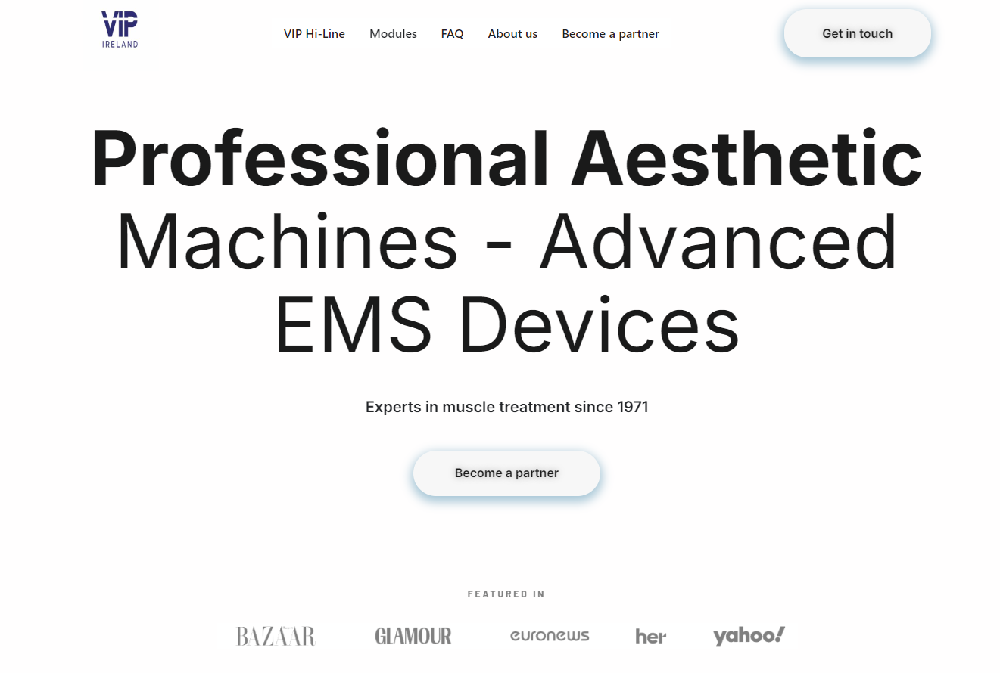

```{=html}
<style>.quarto-title h1.title{display:none}</style>

<div class="proj-header">
  <h1 class="proj-title">VIP Ireland</h1>
  <p class="proj-subtitle">A full website built from scratch for VIP Ireland, an Irish distributor of professional aesthetic machines and advanced EMS devices.</p>
  <a href="index.html" class="proj-back">← Personal projects</a>
  <div class="proj-tags">
    <span class="pp-tag">Freelance</span>
    <span class="pp-tag">Personal</span>
  </div>
  <div class="proj-meta">
    <div class="proj-meta__item">
      <span class="proj-meta__label">Year</span>
      <span class="proj-meta__value">2025</span>
    </div>
    <div class="proj-meta__item">
      <span class="proj-meta__label">Type</span>
      <span class="proj-meta__value">Freelance</span>
    </div>
    <div class="proj-meta__item">
      <span class="proj-meta__label">URL</span>
      <a href="https://vipireland.ie" target="_blank" class="proj-meta__value proj-meta__link">vipireland.ie</a>
    </div>
  </div>
</div>

<div class="proj-screenshot">
  
</div>

<div class="proj-divider"></div>

<div class="proj-section">
  <h2 class="proj-section__title">About the project</h2>
  <p>VIP Ireland is an Irish distributor for a range of professional aesthetic machines and advanced EMS devices, catering to clinics, therapists, and wellness businesses across Ireland. The client needed a clean, credible website that communicated the premium nature of the product range and made it easy for potential partners to get in touch.</p>
  <p>This was my first website built entirely from scratch using WordPress and Elementor Pro. I handled everything from the initial setup and theme configuration through to page design, navigation structure, content layout, and mobile responsiveness.</p>
</div>

<div class="proj-divider"></div>

<div class="proj-section">
  <h2 class="proj-section__title">What I built</h2>
  <div class="proj-grid">
    <div class="proj-card">
      <span class="proj-card__label">Pages</span>
      <span class="proj-card__value">VIP Hi-Line, Modules, FAQ, About us, Become a partner, Contact</span>
    </div>
    <div class="proj-card">
      <span class="proj-card__label">Tools used</span>
      <span class="proj-card__value">WordPress, Elementor Pro, custom CSS</span>
    </div>
    <div class="proj-card">
      <span class="proj-card__label">Focus areas</span>
      <span class="proj-card__value">Layout design, branding, mobile responsiveness, navigation structure</span>
    </div>
    <div class="proj-card">
      <span class="proj-card__label">Outcome</span>
      <span class="proj-card__value">Fully live professional website at vipireland.ie</span>
    </div>
  </div>
</div>

<div class="proj-divider"></div>

<div class="proj-section">
  <h2 class="proj-section__title">Reflection</h2>
  <p>As my first WordPress project, VIP Ireland was a steep but rewarding learning curve. Getting to grips with Elementor Pro, understanding how WordPress themes and plugins interact, and learning to build responsive layouts took time and iteration. By the end of the project I had a solid foundation in the platform and a finished site I was genuinely proud of.</p>
  <p>The experience taught me how to translate a client brief into a real working product, manage the full build process independently, and deliver something polished on a live domain.</p>
</div>

<div class="proj-divider"></div>

<a href="https://vipireland.ie" target="_blank" class="proj-btn">Visit vipireland.ie</a>
```
