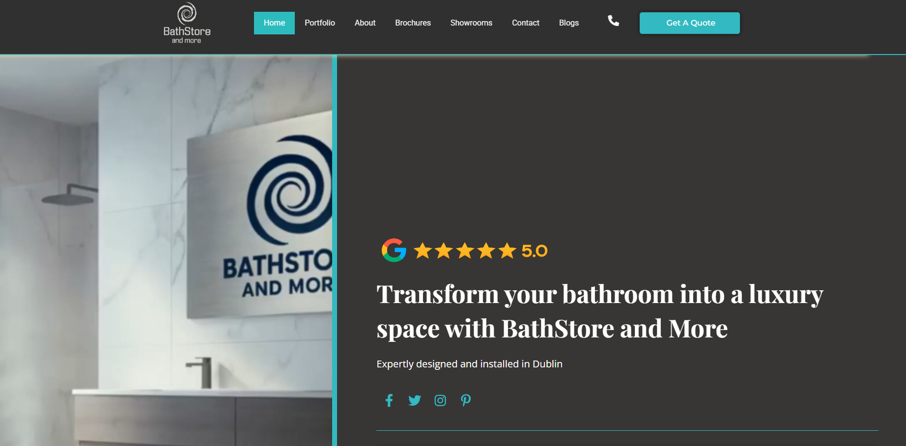

```{=html}
<a href="personal.html" class="proj-back">Personal projects</a>

<div class="proj-header">
  <div class="proj-label">Web design · 2025</div>
  <h1 class="proj-title">Bath Store and More</h1>
  <p class="proj-subtitle">A full website built for Bath Store and More, a Dublin-based bathroom design and installation company offering luxury bathroom solutions.</p>
  <div class="proj-tags">
    <span class="pp-tag">WordPress</span>
    <span class="pp-tag">Elementor Pro</span>
    <span class="pp-tag">HTML</span>
    <span class="pp-tag">CSS</span>
  </div>
  <div class="proj-meta">
    <div class="proj-meta__item">
      <span class="proj-meta__label">Year</span>
      <span class="proj-meta__value">2025</span>
    </div>
    <div class="proj-meta__item">
      <span class="proj-meta__label">Type</span>
      <span class="proj-meta__value">Freelance</span>
    </div>
    <div class="proj-meta__item">
      <span class="proj-meta__label">URL</span>
      <a href="https://www.bathstoreandmore.ie" target="_blank" class="proj-meta__value proj-meta__link">bathstoreandmore.ie</a>
    </div>
  </div>
</div>

<div class="proj-screenshot">
  
</div>

<div class="proj-divider"></div>

<div class="proj-section">
  <h2 class="proj-section__title">About the project</h2>
  <p>Bath Store and More is a Dublin-based bathroom design and installation company helping homeowners transform their bathrooms into luxury spaces. The business needed a professional website to showcase their portfolio, share brochures, highlight showrooms, and make it easy for customers to get a quote.</p>
  <p>This was my second WordPress and Elementor Pro build. Having gone through the learning curve with VIP Ireland, the process was noticeably smoother. I was more confident in the platform, faster with the layout tools, and better at making design decisions from the start.</p>
</div>

<div class="proj-divider"></div>

<div class="proj-section">
  <h2 class="proj-section__title">What I built</h2>
  <div class="proj-grid">
    <div class="proj-card">
      <span class="proj-card__label">Pages</span>
      <span class="proj-card__value">Home, Portfolio, About, Brochures, Showrooms, Contact, Blogs</span>
    </div>
    <div class="proj-card">
      <span class="proj-card__label">Tools used</span>
      <span class="proj-card__value">WordPress, Elementor Pro, custom CSS</span>
    </div>
    <div class="proj-card">
      <span class="proj-card__label">Focus areas</span>
      <span class="proj-card__value">Portfolio presentation, brochure downloads, quote request flow, mobile responsiveness</span>
    </div>
    <div class="proj-card">
      <span class="proj-card__label">Outcome</span>
      <span class="proj-card__value">Fully live professional website at bathstoreandmore.ie</span>
    </div>
  </div>
</div>

<div class="proj-divider"></div>

<div class="proj-section">
  <h2 class="proj-section__title">Reflection</h2>
  <p>Compared to VIP Ireland, this project felt like a different experience entirely. The foundational knowledge I had built on the first site meant I could focus more on design quality and less on figuring out the tools. The result is a richer, more visual site with a stronger layout and better overall user experience.</p>
  <p>Building two client sites back to back gave me a real sense of progression. I can see the improvement between the two projects and it has given me confidence to take on more complex web design work going forward.</p>
</div>

<div class="proj-divider"></div>

<a href="https://www.bathstoreandmore.ie" target="_blank" class="proj-btn">Visit bathstoreandmore.ie</a>
```
