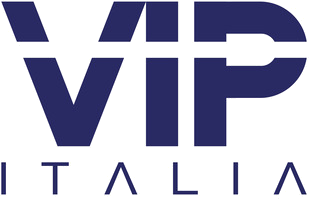

```{=html}
<div class="pp-header">
<h1 class="pp-title">Personal Projects</h1>
<p class="pp-subtitle">Projects built outside of college, including client websites and personal pursuits. These reflect my interests and skills beyond the academic curriculum.</p>
</div>

<div class="pp-section-label">Web Design</div>
<div class="pp-section-divider"></div>

<div class="pp-cards">

<div class="pp-card pp-card--horizontal">
<div class="pp-card__logo">
<a href="vip-ireland.html"></a>
</div>
<div class="pp-card__body">
<div class="pp-card__tags">
<span class="pp-tag">WordPress</span>
<span class="pp-tag">HTML</span>
<span class="pp-tag">CSS</span>
</div>
<div class="pp-card__title">VIP Ireland</div>
<div class="pp-card__url">vipireland.ie</div>
<p class="pp-card__desc">Designed and built a professional website for VIP Ireland using WordPress. Handled layout, branding, content structure, and mobile responsiveness from brief to delivery.</p>
<div class="pp-card__footer">
<span class="pp-card__date">2025</span>
<a href="vip-ireland.html" class="pp-card__link">View project</a>
</div>
</div>
</div>

<div class="pp-card pp-card--horizontal">
<div class="pp-card__logo">
<a href="bathstore.html"></a>
</div>
<div class="pp-card__body">
<div class="pp-card__tags">
<span class="pp-tag">WordPress</span>
<span class="pp-tag">HTML</span>
<span class="pp-tag">CSS</span>
</div>
<div class="pp-card__title">Bath Store and More</div>
<div class="pp-card__url">bathstoreandmore.ie</div>
<p class="pp-card__desc">Built a website for Bath Store and More using WordPress, focused on product presentation, clean visual design, and a strong user experience across devices.</p>
<div class="pp-card__footer">
<span class="pp-card__date">2025</span>
<a href="bathstore.html" class="pp-card__link">View project</a>
</div>
</div>
</div>

</div>

<div class="pp-section-label pp-section-label--spaced">Personal</div>
<div class="pp-section-divider"></div>

<div class="pp-cards">

<div class="pp-card pp-card--feature">
<div class="pp-card__banner">

</div>
<div class="pp-card__body">
<div class="pp-card__tags">
<span class="pp-tag">Bodybuilding</span>
<span class="pp-tag">Fitness</span>
<span class="pp-tag">Lifestyle</span>
</div>
<div class="pp-card__title">My fitness journey</div>
<p class="pp-card__desc">A personal log of my journey into competitive bodybuilding. Covering training, nutrition, progress, and the mindset behind building a competition-ready physique.</p>
<div class="pp-stats">
<div class="pp-stat">
<span class="pp-stat__value">2023</span>
<span class="pp-stat__label">Started training</span>
</div>
<div class="pp-stat">
<span class="pp-stat__value">2027</span>
<span class="pp-stat__label">First competition</span>
</div>
<div class="pp-stat">
<span class="pp-stat__value">5 days</span>
<span class="pp-stat__label">Weekly training</span>
</div>
</div>
<div class="pp-card__footer">
<span class="pp-card__date">Ongoing</span>
<a href="fitness.html" class="pp-card__link">View journey</a>
</div>
</div>
</div>

</div>
```
